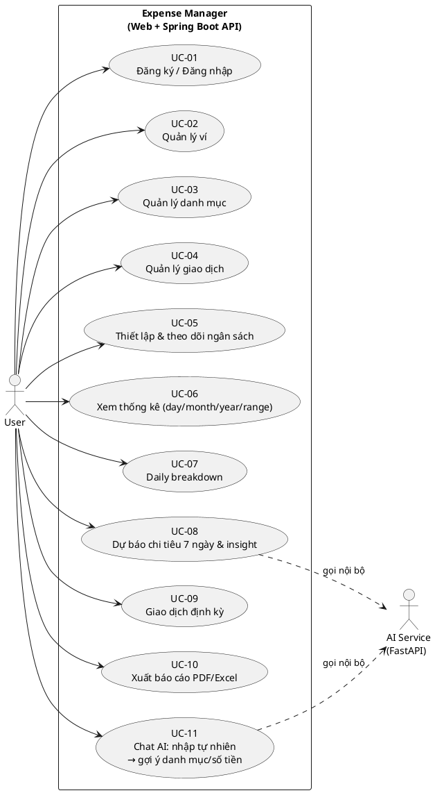
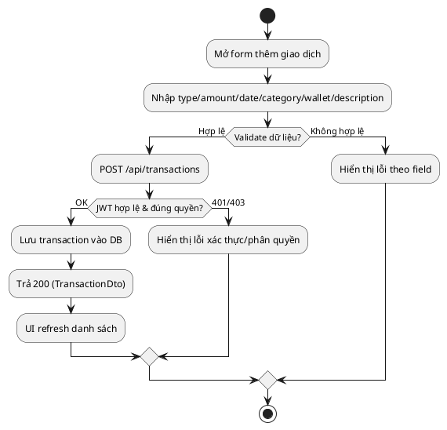
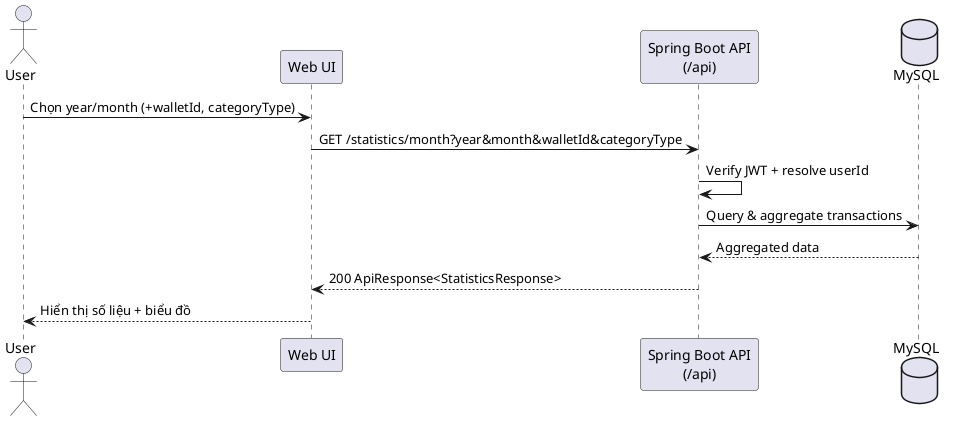
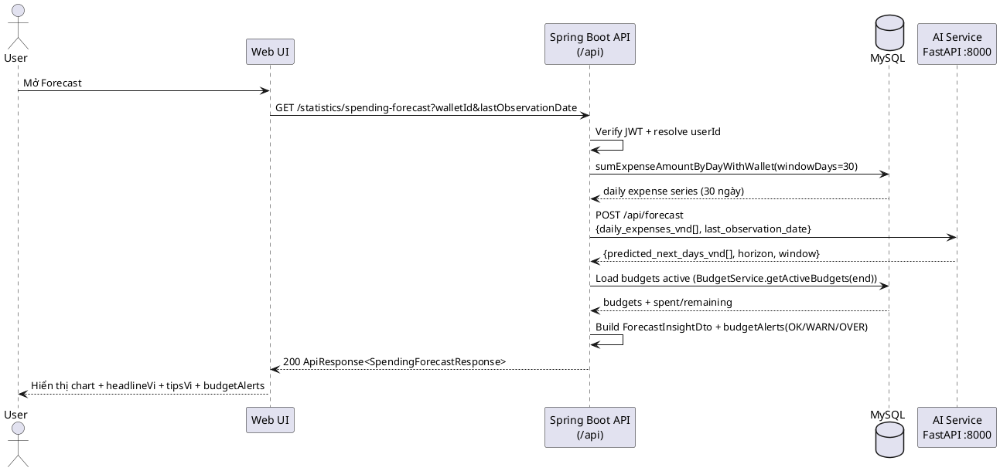
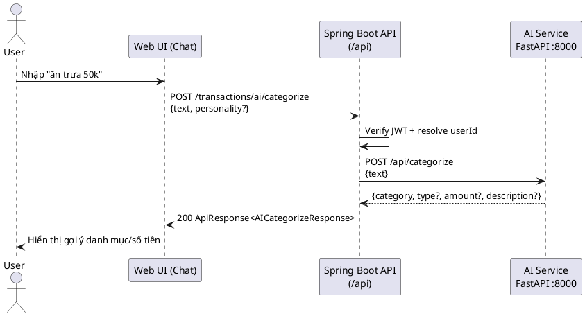
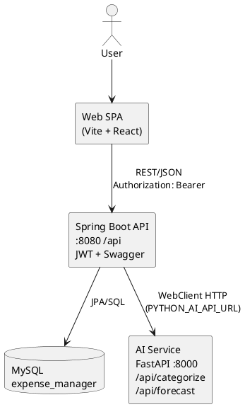

  # PHÂN TÍCH & THIẾT KẾ HỆ THỐNG  
  **Đề tài**: Expense Manager — Quản lý thu/chi + ngân sách + giao dịch định kỳ + xuất báo cáo + trợ lý AI phân loại & dự báo  
  **Phiên bản**: 1.0 (báo cáo tiến độ)  
  **Ngày**: 20/04/2026  

  > Tài liệu này dùng cho báo cáo tiến độ đồ án: mô tả bài toán, yêu cầu, mô hình nghiệp vụ, thiết kế kiến trúc, thiết kế dữ liệu, thiết kế API, thiết kế UI, bảo mật, kiểm thử và kế hoạch triển khai.

  ---

  ## Mục lục
  - [1. Tổng quan](#1-tổng-quan)
  - [2. Phạm vi & ràng buộc](#2-phạm-vi--ràng-buộc)
  - [3. Đối tượng sử dụng & phân quyền](#3-đối-tượng-sử-dụng--phân-quyền)
  - [4. Yêu cầu hệ thống](#4-yêu-cầu-hệ-thống)
    - [4.1. Yêu cầu chức năng (FR)](#41-yêu-cầu-chức-năng-fr)
    - [4.2. Yêu cầu phi chức năng (NFR)](#42-yêu-cầu-phi-chức-năng-nfr)
  - [5. Mô hình nghiệp vụ](#5-mô-hình-nghiệp-vụ)
    - [5.1. Danh sách use case](#51-danh-sách-use-case)
    - [5.2. Đặc tả use case tiêu biểu](#52-đặc-tả-use-case-tiêu-biểu)
  - [6. Thiết kế kiến trúc](#6-thiết-kế-kiến-trúc)
    - [6.1. Kiến trúc tổng thể](#61-kiến-trúc-tổng-thể)
    - [6.2. Thiết kế module](#62-thiết-kế-module)
    - [6.3. Luồng dữ liệu tiêu biểu](#63-luồng-dữ-liệu-tiêu-biểu)
  - [7. Thiết kế dữ liệu (CSDL)](#7-thiết-kế-dữ-liệu-csdl)
    - [7.1. Thực thể & quan hệ](#71-thực-thể--quan-hệ)
    - [7.2. Từ điển dữ liệu (tóm tắt)](#72-từ-điển-dữ-liệu-tóm-tắt)
    - [7.3. Quy ước & ràng buộc](#73-quy-ước--ràng-buộc)
  - [8. Thiết kế API](#8-thiết-kế-api)
    - [8.1. Quy ước API](#81-quy-ước-api)
    - [8.2. Danh sách endpoint theo module](#82-danh-sách-endpoint-theo-module)
  - [9. Thiết kế giao diện (UI/UX)](#9-thiết-kế-giao-diện-uiux)
  - [10. Bảo mật & nhật ký hệ thống](#10-bảo-mật--nhật-ký-hệ-thống)
  - [11. Kế hoạch kiểm thử](#11-kế-hoạch-kiểm-thử)
  - [12. Triển khai & vận hành](#12-triển-khai--vận-hành)
  - [13. Tiến độ & kế hoạch thực hiện](#13-tiến-độ--kế-hoạch-thực-hiện)
  - [14. Rủi ro & phương án giảm thiểu](#14-rủi-ro--phương-án-giảm-thiểu)

  ---

  ## 1. Tổng quan
  ### 1.1. Bối cảnh
  Trong quản lý tài chính cá nhân, người dùng thường ghi chép thu–chi thủ công (sổ tay/Excel) dẫn tới:
  - Dữ liệu phân tán, khó tổng hợp theo tháng/năm/khoảng thời gian.
  - Khó theo dõi chi tiêu theo danh mục (ăn uống, đi lại, học tập...).
  - Không có cảnh báo ngân sách, nhắc lịch giao dịch định kỳ, và hỗ trợ tự động phân loại.

  ### 1.2. Mục tiêu hệ thống
  Hệ thống hỗ trợ người dùng:
  - Ghi nhận giao dịch **thu** và **chi** theo **ví (wallet)** và **danh mục (category)**.
  - Thiết lập **ngân sách theo danh mục**, theo dõi mức sử dụng ngân sách và **cảnh báo** (OK/WARN/OVER).
  - Quản lý **giao dịch định kỳ** (tự sinh giao dịch theo lịch).
  - Xuất **báo cáo giao dịch** ra **PDF/Excel** theo khoảng ngày.
  - Xem **thống kê** theo ngày/tháng/năm/khoảng ngày và biểu đồ theo danh mục.
  - Dùng **trợ lý AI** để:
    - Gợi ý **phân loại giao dịch** từ câu nhập tự nhiên (ví dụ “ăn trưa 50k”).
    - **Dự báo tổng chi tiêu 7 ngày tới** và sinh insight/khuyến nghị.

  ### 1.3. Đầu ra mong muốn
  - Website/ứng dụng web quản lý thu–chi.
  - Bộ API phục vụ nghiệp vụ và thống kê.
  - CSDL lưu trữ người dùng, ví, danh mục, giao dịch, ngân sách, log.
  - Báo cáo thống kê/dự báo phục vụ ra quyết định chi tiêu.

  ---

  ## 2. Phạm vi & ràng buộc
  ### 2.1. Phạm vi (In-scope)
  - Xác thực người dùng; hồ sơ người dùng.
  - Quản lý ví (tạo/sửa/xóa/đặt mặc định).
  - Quản lý danh mục thu/chi.
  - Quản lý giao dịch (thu/chi): tạo/sửa/xóa, gắn ví và danh mục.
  - Ngân sách: tạo/sửa/xóa, xem danh sách và ngân sách còn hiệu lực.
  - Giao dịch định kỳ: tạo/sửa/xóa, bật/tắt kích hoạt; job sinh giao dịch theo lịch.
  - Thống kê:
    - Theo ngày: `/statistics/day`
    - Theo tháng: `/statistics/month`
    - Theo năm: `/statistics/year`
    - Theo khoảng ngày: `/statistics/range`
    - Theo ngày: `/statistics/daily-breakdown`
  - Dự báo chi tiêu: `/statistics/spending-forecast` (backend gọi AI service).
  - AI:
    - Phân loại giao dịch: `POST /transactions/ai/categorize` (+ batch)
    - Gợi ý chung: `GET /ai/suggestions`
  - Xuất báo cáo: `GET /export/transactions?format=pdf|excel&startDate&endDate`

  ### 2.2. Ngoài phạm vi (Out-of-scope)
  (Tùy chọn, điều chỉnh theo đồ án của bạn)
  - Kết nối ngân hàng tự động (open banking).
  - OCR hóa đơn tự động.
  - Đa tiền tệ và tỷ giá nâng cao.
  - Đồng bộ đa thiết bị offline-first.

  ### 2.3. Ràng buộc
  - Thời gian thực hiện có hạn → ưu tiên chức năng cốt lõi (thu/chi, thống kê, ngân sách).
  - Dự báo chi tiêu ở mức “hỗ trợ quyết định”, không cam kết tuyệt đối chính xác.

  ---

  ## 3. Đối tượng sử dụng & phân quyền
  ### 3.1. Tác nhân (Actors)
  - **User**: người dùng cuối, sử dụng hệ thống để quản lý thu–chi.
  - **AI Service**: dịch vụ FastAPI phục vụ phân loại và dự báo (được backend gọi nội bộ).

  ### 3.2. Phân quyền (RBAC)
  - **User**:
    - Chỉ truy cập dữ liệu của chính mình (wallet, transaction, budget, statistics).
    - Thực hiện CRUD cho ví, danh mục cá nhân, giao dịch, ngân sách.
    - Xem thống kê và dự báo.
  - **Ghi chú**: hệ thống dùng Spring Security + JWT; mọi endpoint nghiệp vụ yêu cầu token (trừ `/auth/*`).

  ---

  ## 4. Yêu cầu hệ thống
  ## 4.1. Yêu cầu chức năng (FR)
  > Quy ước: FR-xx, nhóm theo module. Có thể dùng làm checklist tiến độ.

  ### Nhóm FR-AUTH (xác thực & tài khoản)
  - **FR-01**: Người dùng đăng ký tài khoản.
  - **FR-02**: Người dùng đăng nhập và nhận token phiên làm việc.
  - **FR-03**: Người dùng refresh token (`POST /auth/refresh`).
  - **FR-04**: Xem thông tin user hiện tại (`GET /users/me`).
  - **FR-05**: Cập nhật hồ sơ (`PUT /users/me`, `PATCH /users/me/profile`).
  - **FR-06**: Đổi mật khẩu (`PATCH /users/me/password`).

  ### Nhóm FR-WALLET (quản lý ví)
  - **FR-07**: Xem danh sách ví (`GET /wallets`), xem chi tiết (`GET /wallets/{id}`).
  - **FR-08**: Tạo ví (`POST /wallets`).
  - **FR-09**: Cập nhật ví (`PUT /wallets/{id}`).
  - **FR-10**: Xóa ví (`DELETE /wallets/{id}`).

  ### Nhóm FR-CATEGORY (danh mục)
  - **FR-11**: Tạo danh mục (`POST /categories`).
  - **FR-12**: Xem danh mục theo trang + lọc type (`GET /categories?page&size&type`).
  - **FR-13**: Xem danh mục theo type nhanh (`GET /categories/by-type/{type}`).
  - **FR-14**: Cập nhật danh mục (`PUT /categories/{id}`).
  - **FR-15**: Xóa danh mục (`DELETE /categories/{id}`).

  ### Nhóm FR-TRANSACTION (giao dịch thu/chi)
  - **FR-16**: Thêm giao dịch (`POST /transactions`) với: type, amount, description, transactionDate, categoryId, walletId (optional).
  - **FR-17**: Xem chi tiết giao dịch (`GET /transactions/{id}`).
  - **FR-18**: Danh sách giao dịch có phân trang + lọc (`GET /transactions?page&size&type&categoryId&walletId&startDate&endDate`).
  - **FR-19**: Cập nhật giao dịch (`PUT /transactions/{id}`).
  - **FR-20**: Xóa giao dịch (`DELETE /transactions/{id}`).

  ### Nhóm FR-BUDGET (ngân sách)
  - **FR-21**: Tạo ngân sách (`POST /budgets`) theo khoảng ngày `startDate`–`endDate` + category + note.
  - **FR-22**: Danh sách ngân sách có phân trang (`GET /budgets?page&size`).
  - **FR-23**: Xem ngân sách theo id (`GET /budgets/{id}`).
  - **FR-24**: Xem ngân sách còn hiệu lực theo ngày (`GET /budgets/active?date=`).
  - **FR-25**: Cập nhật ngân sách (`PUT /budgets/{id}`).
  - **FR-26**: Xóa ngân sách (`DELETE /budgets/{id}`).

  ### Nhóm FR-RECURRING (giao dịch định kỳ)
  - **FR-27**: Xem danh sách giao dịch định kỳ (`GET /recurring-transactions`).
  - **FR-28**: Tạo giao dịch định kỳ (`POST /recurring-transactions`) theo `dayOfMonth`, `startDate`, `endDate` (optional), `isActive`.
  - **FR-29**: Cập nhật giao dịch định kỳ (`PUT /recurring-transactions/{id}`).
  - **FR-30**: Xóa giao dịch định kỳ (`DELETE /recurring-transactions/{id}`).
  - **FR-31**: Bật/tắt kích hoạt (`PATCH /recurring-transactions/{id}/toggle`).

  ### Nhóm FR-STATISTICS (thống kê)
  - **FR-32**: Thống kê theo ngày (`GET /statistics/day?date&walletId`).
  - **FR-33**: Thống kê theo tháng (`GET /statistics/month?year&month&categoryType&walletId`).
  - **FR-34**: Thống kê theo năm (`GET /statistics/year?year&categoryType&walletId`).
  - **FR-35**: Thống kê theo khoảng ngày (`GET /statistics/range?startDate&endDate&categoryType&walletId`).
  - **FR-36**: Daily breakdown (`GET /statistics/daily-breakdown?startDate&endDate`).

  ### Nhóm FR-FORECAST (dự báo)
  - **FR-37**: Dự báo tổng chi tiêu 7 ngày tới (`GET /statistics/spending-forecast?walletId&lastObservationDate`).

  ### Nhóm FR-AI (trợ lý AI)
  - **FR-38**: AI phân loại 1 giao dịch từ câu tự nhiên (`POST /transactions/ai/categorize`).
  - **FR-39**: AI phân loại batch (tách nhiều khoản từ một câu) (`POST /transactions/ai/categorize/batch`).
  - **FR-40**: AI suggestions (gợi ý tổng quát) (`GET /ai/suggestions`).

  ### Nhóm FR-EXPORT (xuất báo cáo)
  - **FR-41**: Xuất báo cáo giao dịch PDF (`GET /export/transactions?format=pdf&startDate&endDate`).
  - **FR-42**: Xuất báo cáo giao dịch Excel (`GET /export/transactions?format=excel&startDate&endDate`).

  ---

  ## 4.2. Yêu cầu phi chức năng (NFR)
  ### 4.2.1. Hiệu năng
  - **NFR-P01**: Các trang danh sách (giao dịch) phải phân trang.
  - **NFR-P02**: Thời gian phản hồi thống kê theo tháng/năm phải ổn định với dữ liệu lớn (cần index theo `userId`, `walletId`, `date`).
  - **NFR-P03**: Xuất PDF/Excel cần chạy nền/giới hạn khoảng ngày hợp lý để tránh timeout.

  ### 4.2.2. Bảo mật
  - **NFR-S01**: Mật khẩu được băm (bcrypt/argon2), không lưu plain text.
  - **NFR-S02**: API yêu cầu xác thực, kiểm tra quyền truy cập theo `userId` cho mọi dữ liệu cá nhân.
  - **NFR-S03**: Bảo vệ chống SQL injection, XSS, CSRF (tùy mô hình auth).
  - **NFR-S04**: Không trả về thông tin nhạy cảm trong response (hash mật khẩu, refresh token...).
  - **NFR-S05**: JWT có hạn; hỗ trợ refresh token theo cấu hình `jwt.refresh-expiration-ms`.

  ### 4.2.3. Tin cậy & an toàn dữ liệu
  - **NFR-R01**: Có cơ chế backup/restore CSDL (mức đồ án: mô tả quy trình).
  - **NFR-R02**: Khi lỗi hệ thống, trả về mã lỗi thống nhất và thông điệp rõ ràng.
  - **NFR-R03**: Khi AI service không sẵn sàng, backend trả lỗi rõ ràng hoặc fallback (không làm hỏng CRUD giao dịch).

  ### 4.2.4. Khả dụng & UX
  - **NFR-U01**: Có trạng thái loading/empty/error cho mọi màn hình.
  - **NFR-U02**: Validate dữ liệu đầu vào ở cả client và server.

  ### 4.2.5. Bảo trì & mở rộng
  - **NFR-M01**: Tách lớp rõ ràng (controller/service/repository hoặc tương đương).
  - **NFR-M02**: Có tài liệu API (Swagger/OpenAPI) hoặc mô tả endpoint rõ ràng.

  ---

  ## 5. Mô hình nghiệp vụ
  ## 5.1. Danh sách use case
  ### Use case cho User
  - **UC-01**: Đăng ký / Đăng nhập / Đăng xuất
  - **UC-02**: Quản lý ví
  - **UC-03**: Quản lý danh mục thu/chi
  - **UC-04**: Quản lý giao dịch thu/chi
  - **UC-05**: Thiết lập & theo dõi ngân sách
  - **UC-06**: Xem thống kê theo tháng/năm/khoảng thời gian
  - **UC-07**: Xem phân tích theo ngày
  - **UC-08**: Xem dự báo chi tiêu và khuyến nghị

  ### Use case cho Admin (nếu có)
  - **UC-A01**: Quản trị người dùng
  - **UC-A02**: Giám sát log, cấu hình hệ thống

  ### 5.1.1. Sơ đồ Use Case (UML)
  > Bạn có thể copy nguyên khối này vào báo cáo. Nếu trường yêu cầu UML chuẩn, sơ đồ Use Case là “bắt buộc” nhất.

  ```mermaid
  flowchart LR
    %% Actors
    User([User])
  AI([AI Service\nFastAPI])

    %% System boundary
  subgraph SYS["Expense Manager (Web + Spring Boot API)"]
    UC01([UC-01\nĐăng ký/Đăng nhập])
      UC02([UC-02\nQuản lý ví])
      UC03([UC-03\nQuản lý danh mục])
      UC04([UC-04\nQuản lý giao dịch])
      UC05([UC-05\nThiết lập & theo dõi ngân sách])
      UC06([UC-06\nXem thống kê tháng/năm/range])
      UC07([UC-07\nThống kê theo ngày])
    UC08([UC-08\nDự báo chi tiêu 7 ngày & insight])
      UC09([UC-09\nGiao dịch định kỳ])
      UC10([UC-10\nXuất báo cáo PDF/Excel])
      UC11([UC-11\nChat AI: nhập tự nhiên → gợi ý danh mục/số tiền])
    end

    User --> UC01
    User --> UC02
    User --> UC03
    User --> UC04
    User --> UC05
    User --> UC06
    User --> UC07
    User --> UC08
    User --> UC09
    User --> UC10
    User --> UC11

  %% External system interactions
  UC11 -. gọi nội bộ .-> AI
  UC08 -. gọi nội bộ .-> AI
  ```

  ---

  ## 5.2. Đặc tả use case tiêu biểu
  ### UC-04: Quản lý giao dịch thu/chi
  - **Tác nhân**: User  
  - **Tiền điều kiện**: User đã đăng nhập; có ít nhất 1 ví; có danh mục phù hợp  
  - **Luồng chính**:
    - User mở màn hình giao dịch → chọn “Thêm giao dịch”
    - Nhập: loại (INCOME/EXPENSE), ví, danh mục, số tiền, ngày, ghi chú
    - Hệ thống kiểm tra hợp lệ dữ liệu
    - Hệ thống lưu giao dịch và cập nhật thống kê/ảnh hưởng ngân sách
    - Hiển thị giao dịch mới trong danh sách
  - **Luồng thay thế**:
    - Dữ liệu không hợp lệ → báo lỗi tại field tương ứng
    - Không có quyền truy cập ví/danh mục → trả về 403
  - **Hậu điều kiện**: Giao dịch được lưu; thống kê có thể thay đổi tương ứng

  ### UC-06: Xem thống kê theo tháng
  - **Tác nhân**: User  
  - **Tiền điều kiện**: User đã đăng nhập; có dữ liệu giao dịch hoặc rỗng  
  - **Luồng chính**:
    - User chọn tháng/năm và (tuỳ chọn) ví, loại danh mục
    - Hệ thống tính: tổng thu, tổng chi, số dư, top danh mục
    - Trả về dữ liệu để hiển thị biểu đồ và số liệu tổng hợp
  - **Hậu điều kiện**: Không thay đổi dữ liệu

  ### UC-08: Xem dự báo chi tiêu
  - **Tác nhân**: User  
  - **Tiền điều kiện**: User đã đăng nhập; có dữ liệu chi tiêu lịch sử tối thiểu  
  - **Luồng chính**:
    - User mở “Dự báo”
    - Hệ thống trả về chuỗi dự báo chi tiêu vài ngày tới, horizon/window, insight, cảnh báo ngân sách
    - UI hiển thị: headline, tips, mức độ cảnh báo và gợi ý điều chỉnh
  - **Luồng thay thế**:
    - Thiếu dữ liệu → hệ thống trả về dự báo rỗng hoặc insight mức OK kèm khuyến nghị nhập thêm dữ liệu

  ### 5.2.1. Sơ đồ Activity (luồng nghiệp vụ)
  #### Activity: Thêm giao dịch thu/chi (UC-04)
  ```mermaid
  flowchart TD
    A([Bắt đầu]) --> B[Người dùng mở form thêm giao dịch]
    B --> C[Nhập: loại, ví, danh mục, số tiền, ngày, ghi chú]
    C --> D{Validate dữ liệu?}
    D -- Không hợp lệ --> E[Hiển thị lỗi tại field] --> C
    D -- Hợp lệ --> F[Gửi request tạo giao dịch]
    F --> G{Backend xác thực & kiểm tra quyền?}
    G -- Không --> H[Trả 401/403] --> C
    G -- Có --> I[Lưu giao dịch vào DB]
    I --> J[Cập nhật số liệu thống kê / ảnh hưởng ngân sách]
    J --> K[Trả kết quả thành công]
    K --> L[UI refresh danh sách/hiển thị giao dịch mới]
    L --> M([Kết thúc])
  ```

  #### Activity: Xem thống kê theo tháng (UC-06)
  ```mermaid
  flowchart TD
    A([Bắt đầu]) --> B[Chọn tháng/năm, ví (tuỳ chọn), loại (tuỳ chọn)]
    B --> C[Gọi API /statistics/month]
    C --> D{Xác thực token?}
    D -- Không --> E[401] --> B
    D -- Có --> F[Truy vấn giao dịch theo điều kiện]
    F --> G[Tổng hợp totalIncome/totalExpense/balance]
    G --> H[Tổng hợp byCategory]
    H --> I[Trả JSON]
    I --> J[UI hiển thị số liệu + biểu đồ]
    J --> K([Kết thúc])
  ```

  ### 5.2.2. Sơ đồ Sequence (tương tác UI–API–DB)
  #### Sequence: Thống kê theo tháng
  ```mermaid
  sequenceDiagram
    autonumber
    actor U as User
    participant FE as Web UI
    participant API as Spring Boot API (/api)
    participant DB as Database

    U->>FE: Chọn tháng/năm (+ ví, loại)
    FE->>API: GET /statistics/month?year&month&walletId&categoryType
    API->>API: Verify JWT + resolve userId
    API->>DB: Query transactions filtered by userId, month, walletId, type
    DB-->>API: Result rows
    API->>API: Aggregate totals + byCategory
    API-->>FE: 200 {data: Statistics}
    FE-->>U: Hiển thị dashboard + biểu đồ
  ```

  #### Sequence: Dự báo chi tiêu
  ```mermaid
  sequenceDiagram
    autonumber
    actor U as User
    participant FE as Web UI
    participant API as Spring Boot API (/api)
    participant DB as Database
    participant AI as AI Service (FastAPI)

    U->>FE: Mở màn hình Dự báo
    FE->>API: GET /statistics/spending-forecast?walletId&lastObservationDate
    API->>API: Verify JWT + resolve userId
  API->>DB: Query expense series theo ngày (windowDays=30)
    DB-->>API: Expense time series
  API->>AI: POST /api/forecast {daily_expenses_vnd[], last_observation_date}
  AI-->>API: predicted_next_days_vnd[] (+ horizon, window)
  API->>DB: Query ngân sách đang hiệu lực (Budgets active theo ngày)
  DB-->>API: Budgets + spent/remaining (BudgetService tính)
  API->>API: Build ForecastInsightDto + budgetAlerts (OK/WARN/OVER)
    API-->>FE: 200 {data: SpendingForecast}
    FE-->>U: Hiển thị biểu đồ + tips + cảnh báo
  ```

  #### Sequence: Chat AI phân loại giao dịch
  ```mermaid
  sequenceDiagram
    autonumber
    actor U as User
    participant FE as Web UI (Chat)
    participant API as Spring Boot API (/api)
    participant AI as AI Service (FastAPI)

    U->>FE: Nhập: "ăn trưa 50k"
    FE->>API: POST /transactions/ai/categorize {text, personality?}
    API->>API: Verify JWT + resolve userId
    API->>AI: POST /api/categorize {text, personality?}
    AI-->>API: categoryName, categoryId?, amount?, description?
    API-->>FE: 200 {data: AICategorizeResponse}
    FE-->>U: Hiển thị gợi ý danh mục/số tiền
  ```

  ---

  ## 6. Thiết kế kiến trúc
  ## 6.1. Kiến trúc tổng thể
  Mô hình triển khai thực tế trong repo: **Web Client (SPA) + Spring Boot REST API + MySQL + AI Service (FastAPI)**
  - **Frontend (Web)**:
    - Giao diện người dùng, gọi API, hiển thị thống kê/biểu đồ.
  - **Backend (API Service)**:
    - Xác thực, phân quyền, xử lý nghiệp vụ, tính toán thống kê & dự báo.
  - **Database**:
    - Lưu user, wallet, category, transaction, budget, audit log.
  - **AI Service (FastAPI)**:
    - Endpoint phân loại: `/api/categorize`
    - Endpoint dự báo: `/api/forecast`
    - Backend gọi qua `PYTHON_AI_API_URL` (mặc định `http://localhost:8000`)

  ### 6.1.1. Sơ đồ kiến trúc tổng thể
  ```mermaid
  flowchart LR
    U[User Browser] -->|HTTPS| FE[Frontend Web (SPA)]
    FE -->|REST/JSON + JWT| API[Spring Boot API\n:8080 /api]
    API -->|SQL| DB[(Database)]

    API -->|HTTP| AI[AI Service FastAPI\n:8000]
    AI -->|Models .pt| MODELS[(ML models files)]

    API --> LOG[(Logs)]
  ```

  ## 6.2. Thiết kế module
  - **Auth module**: login/register/token/refresh (tùy chọn).
  - **User module**: profile, cài đặt.
  - **Wallet module**: CRUD ví, ví mặc định.
  - **Category module**: CRUD danh mục, phân loại INCOME/EXPENSE.
  - **Transaction module**: CRUD giao dịch, lọc/phân trang.
  - **Budget module**: ngân sách theo danh mục/thời gian, cảnh báo.
  - **Statistics module**:
    - Tổng hợp theo tháng/năm/range
    - Daily breakdown
    - Spending forecast + insight + budget alerts
  - **Logging/Audit module**: ghi nhận sự kiện quan trọng, lỗi.

  ## 6.3. Luồng dữ liệu tiêu biểu
  ### Luồng “Xem thống kê theo tháng”
  - UI gửi request `GET /statistics/month?year=Y&month=M&walletId=...&categoryType=...`
  - Backend xác thực token → xác định `userId`
  - Backend truy vấn transaction theo điều kiện (`userId`, tháng, ví, loại danh mục)
  - Backend tổng hợp: totalIncome/totalExpense/balance và byCategory
  - Trả response dạng envelope: `data: { totalIncome, totalExpense, balance, byCategory[] }`

  ### Luồng “Dự báo chi tiêu”
  - UI gọi `GET /statistics/spending-forecast?walletId=...&lastObservationDate=...`
  - Backend lấy dữ liệu chi tiêu lịch sử (cửa sổ `window`, ví dụ 30 ngày)
  - Backend tính dự báo `predictedNextDaysVnd[]` (horizon N ngày) và insight
  - Backend tính cảnh báo ngân sách theo danh mục (OK/WARN/OVER)
  - Trả về: `predictedNextDaysVnd`, `horizon`, `window`, `lastObservationDate`, `insight`

  ---

  ## 7. Thiết kế dữ liệu (CSDL)
  > Lưu ý: tên bảng/cột có thể điều chỉnh theo công nghệ bạn đang dùng. Phần này cung cấp thiết kế chuẩn để đưa vào báo cáo.

  ## 7.1. Thực thể & quan hệ
  ### Thực thể chính
  - **User** (1) — (N) **Wallet**
  - **User** (1) — (N) **Category**
  - **User** (1) — (N) **Transaction**
  - **Wallet** (1) — (N) **Transaction**
  - **Category** (1) — (N) **Transaction**
  - **Category** (1) — (N) **Budget**
  - **User** (1) — (N) **Budget**
  - **User** (1) — (N) **RecurringTransaction**
  - **RecurringTransaction** (1) — (N) **Transaction** (các giao dịch được sinh ra)

  ### 7.1.1. ERD (Mermaid)
  ```mermaid
  erDiagram
    USERS ||--o{ WALLETS : has
    USERS ||--o{ CATEGORIES : has
    USERS ||--o{ TRANSACTIONS : creates
    USERS ||--o{ BUDGETS : defines
    USERS ||--o{ RECURRING_TRANSACTIONS : defines

    WALLETS ||--o{ TRANSACTIONS : contains
    CATEGORIES ||--o{ TRANSACTIONS : classifies
    CATEGORIES ||--o{ BUDGETS : budgets
    RECURRING_TRANSACTIONS ||--o{ TRANSACTIONS : spawns

    USERS {
      int id PK
      string email "unique"
      string passwordHash
      string fullName
      string status
      datetime createdAt
      datetime updatedAt
    }

    WALLETS {
      int id PK
      int userId FK
      string name
      string description
      decimal initialBalanceVnd
      boolean isDefault
      datetime createdAt
      datetime updatedAt
    }

    CATEGORIES {
      int id PK
      int userId FK
      string name
      string type "INCOME|EXPENSE"
      datetime createdAt
      datetime updatedAt
    }

    TRANSACTIONS {
      int id PK
      int userId FK
      int walletId FK
      int categoryId FK
      int recurringTransactionId FK
      string type "INCOME|EXPENSE"
    decimal amount
    date transactionDate
    string description
      datetime createdAt
      datetime updatedAt
    }

    BUDGETS {
      int id PK
      int userId FK
      int categoryId FK
      date startDate
      date endDate
    decimal amount "ngân sách"
      string note
      datetime createdAt
      datetime updatedAt
    }

    RECURRING_TRANSACTIONS {
      int id PK
      int userId FK
      int categoryId FK
      string type "INCOME|EXPENSE"
      decimal amount
      string description
      int dayOfMonth
      date startDate
      date endDate
      boolean isActive
      datetime createdAt
    }
  ```

  ## 7.2. Từ điển dữ liệu (tóm tắt)
  ### Bảng `users`
  - `id` (PK)
  - `email` (unique), `passwordHash`
  - `fullName` (nullable), `status`
  - `createdAt`, `updatedAt`

  ### Bảng `wallets`
  - `id` (PK), `userId` (FK -> users.id)
  - `name`, `description` (nullable)
  - `initialBalanceVnd` (nullable), `isDefault`
  - `createdAt`, `updatedAt`

  ### Bảng `categories`
  - `id` (PK), `userId` (FK)
  - `name`
  - `type` (enum: INCOME | EXPENSE)
  - `createdAt`, `updatedAt`

  ### Bảng `transactions`
  - `id` (PK), `userId` (FK)
  - `walletId` (FK), `categoryId` (FK)
  - `type` (INCOME | EXPENSE) (có thể suy ra từ category)
  - `amountVnd`
  - `date` (ngày phát sinh)
  - `note` (nullable)
  - `createdAt`, `updatedAt`

  ### Bảng `budgets`
  - `id` (PK), `userId` (FK)
  - `categoryId` (FK)
  - `periodYear`, `periodMonth` (hoặc `startDate`, `endDate`)
  - `budgetAmountVnd`
  - `createdAt`, `updatedAt`

  ### Bảng `audit_logs`
  - `id` (PK), `userId` (FK)
  - `action` (LOGIN, CREATE_TRANSACTION, UPDATE_BUDGET, ...)
  - `entityType`, `entityId` (nullable)
  - `metadata` (JSON, nullable)
  - `createdAt`

  ## 7.3. Quy ước & ràng buộc
  - Mọi bảng dữ liệu người dùng đều có `userId` để enforce multi-tenant theo user.
  - Index gợi ý:
    - `transactions(userId, date)`
    - `transactions(userId, walletId, date)`
    - `transactions(userId, categoryId, date)`
    - `budgets(userId, periodYear, periodMonth)`
  - Ràng buộc xóa:
    - Không cho xóa `wallet/category` nếu còn `transaction` (hoặc dùng soft delete).
    - Nếu soft delete: thêm `deletedAt`, mọi truy vấn lọc `deletedAt IS NULL`.

  ---

  ## 8. Thiết kế API
  ## 8.1. Quy ước API
  - **Giao thức**: REST over HTTPS (mức đồ án có thể mô tả HTTP).
  - **Định dạng**: JSON.
  - **Envelope** (gợi ý theo code frontend):  
    - Response: `{ data: <payload>, message?: string, errors?: ... }`
  - **Xác thực**: `Authorization: Bearer <token>` cho endpoint private.
  - **Mã lỗi**:
    - 400 (validate), 401 (unauth), 403 (forbidden), 404 (not found), 500 (server error).
  - **Base path**: backend chạy tại `http://localhost:8080/api` (context-path `/api`).

  ## 8.2. Danh sách endpoint theo module
  > Danh sách dưới đây khớp với các controller trong `backend/src/main/java/com/expense/controller/*`.

  ### Auth
  - `POST /auth/register`
  - `POST /auth/login`
  - `POST /auth/refresh`

  ### Wallet
  - `GET /wallets`
  - `POST /wallets`
  - `PUT /wallets/:id`
  - `DELETE /wallets/:id`

  ### Category
  - `GET /categories?type=EXPENSE|INCOME`
  - `POST /categories`
  - `PUT /categories/:id`
  - `DELETE /categories/:id`
  - `GET /categories/by-type/:type`

  ### Transaction
  - `GET /transactions?page=&size=&type=&categoryId=&walletId=&startDate=&endDate=`
  - `POST /transactions`
  - `PUT /transactions/:id`
  - `DELETE /transactions/:id`
  - `GET /transactions/:id`
  - `POST /transactions/ai/categorize`
  - `POST /transactions/ai/categorize/batch`

  ### Budget
  - `GET /budgets?page=&size=`
  - `POST /budgets`
  - `GET /budgets/:id`
  - `PUT /budgets/:id`
  - `DELETE /budgets/:id`
  - `GET /budgets/active?date=`

  ### Recurring Transactions
  - `GET /recurring-transactions`
  - `POST /recurring-transactions`
  - `PUT /recurring-transactions/:id`
  - `DELETE /recurring-transactions/:id`
  - `PATCH /recurring-transactions/:id/toggle`

  ### Statistics (đã có trên frontend)
  - `GET /statistics/day?date=&walletId=`
  - `GET /statistics/month?year=&month=&categoryType=&walletId=`
  - `GET /statistics/year?year=&categoryType=&walletId=`
  - `GET /statistics/range?startDate=&endDate=&categoryType=&walletId=`
  - `GET /statistics/daily-breakdown?startDate=&endDate=`
  - `GET /statistics/spending-forecast?walletId=&lastObservationDate=`

  ### AI (gợi ý)
  - `GET /ai/suggestions`

  ### Export
  - `GET /export/transactions?format=pdf|excel&startDate=&endDate=`

  ---

  ## 9. Thiết kế giao diện (UI/UX)
  ### 9.1. Danh sách màn hình
  - **Màn hình đăng nhập/đăng ký**
  - **Dashboard**
    - Tổng thu/chi/số dư trong tháng
    - Biểu đồ theo danh mục (top chi tiêu)
    - Cảnh báo ngân sách
  - **Ví (Wallets)**
    - Danh sách ví, tạo/sửa/xóa, đặt mặc định
  - **Danh mục (Categories)**
    - Danh sách danh mục thu/chi, CRUD
  - **Giao dịch (Transactions)**
    - Danh sách + filter + phân trang
    - Form thêm/sửa giao dịch
  - **Ngân sách (Budgets)**
    - Thiết lập ngân sách theo tháng/danh mục
    - Hiển thị % sử dụng và mức cảnh báo
  - **Thống kê (Statistics)**
    - Theo tháng/năm/range, theo ví, theo thu/chi
    - Daily breakdown (biểu đồ đường/cột)
  - **Dự báo (Forecast)**
    - Predicted next days
    - Insight (headline, tips)
    - Budget alerts theo danh mục

  ### 9.2. Nguyên tắc UX tối thiểu
  - Form có validate rõ ràng (số tiền > 0, ngày hợp lệ, bắt buộc chọn ví/danh mục).
  - Trạng thái loading/empty/error thống nhất.
  - Filter có thể reset nhanh; phân trang giữ query.

  ---

  ## 10. Bảo mật & nhật ký hệ thống
  ### 10.1. Xác thực
  - JWT access token (và refresh token nếu triển khai).
  - Token lưu an toàn (ưu tiên httpOnly cookie nếu có; nếu localStorage cần chống XSS tốt).

  ### 10.2. Phân quyền dữ liệu
  - Mọi truy vấn đều ràng buộc `userId` để ngăn đọc dữ liệu người khác.
  - Kiểm tra quyền trước khi sửa/xóa: chủ sở hữu `walletId/categoryId/transactionId`.

  ### 10.3. Nhật ký & giám sát
  - Audit log: ghi action, entity, thời gian, userId.
  - Error log: stack trace (server-side), correlation id (nếu có).

  ---

  ## 11. Kế hoạch kiểm thử
  ### 11.1. Chiến lược kiểm thử
  - **Unit test** (nếu có): validate, tính toán thống kê cơ bản.
  - **API test**: kiểm thử endpoint CRUD và thống kê.
  - **UI test thủ công**: theo checklist FR.
  - **Kiểm thử phân quyền**: đảm bảo không truy cập dữ liệu user khác.

  ### 11.2. Test case mẫu (rút gọn)
  - Đăng nhập sai mật khẩu → 401 + message.
  - Tạo giao dịch chi 100.000đ → thống kê tháng tăng totalExpense tương ứng.
  - Tạo budget 1.000.000đ cho danh mục “Ăn uống” → khi chi vượt 80% báo WARN, vượt 100% báo OVER.
  - Gọi `/statistics/month` với `walletId` khác → chỉ tính trên ví đó.
  - Dự báo không có dữ liệu lịch sử → trả predicted rỗng/insight OK.

  ---

  ## 12. Triển khai & vận hành
  ### 12.1. Môi trường
  - **Dev**: chạy local FE + BE + DB.
  - **Staging/Prod** (nếu có): deploy trên VPS/Render/Railway/Docker.

  ### 12.1.1. Sơ đồ triển khai (Deployment)
  ```mermaid
  flowchart TB
    subgraph Client["Client"]
      Browser[Browser]
    end

    subgraph Server["Server/Hosting"]
      FE[Frontend static hosting\n(Nginx/Vercel/Netlify)]
      API[Spring Boot API\n:8080 /api]
      AI[FastAPI AI Service\n:8000]
      DB[(Database\nPostgres/MySQL/SQL Server)]
    end

    Browser -->|HTTPS| FE
    Browser -->|HTTPS| API
    API -->|SQL| DB
    API -->|HTTP| AI
  ```

  ### 12.2. Cấu hình
  - Biến môi trường: DB connection, JWT secret, CORS origin, timezone.

  ### 12.3. Backup
  - Mô tả quy trình backup DB định kỳ (daily/weekly) và restore.

  ---

  ## 13. Tiến độ & kế hoạch thực hiện
  > Gợi ý dùng checklist FR để báo cáo tiến độ rõ ràng.

  ### 13.1. Tiến độ hiện tại (cập nhật theo thực tế)
  - Nhóm Statistics đã có các endpoint/clients:
    - `GET /statistics/month`, `GET /statistics/year`, `GET /statistics/range`
    - `GET /statistics/daily-breakdown`
    - `GET /statistics/spending-forecast` (kèm insight & budget alerts)

  ### 13.2. Kế hoạch các mốc
  - Hoàn thiện CRUD: wallet/category/transaction/budget.
  - Hoàn thiện UI thống kê & dự báo (biểu đồ + cảnh báo).
  - Hoàn thiện bảo mật (RBAC + ràng buộc userId).
  - Viết test case & demo dữ liệu mẫu.
  - Hoàn thiện báo cáo & slide.

  ---

  ## 14. Rủi ro & phương án giảm thiểu
  - **Rủi ro dữ liệu mẫu ít**: tạo seed data theo tháng để demo thống kê/dự báo.
  - **Rủi ro truy vấn thống kê chậm**: thêm index, tối ưu query theo `userId` + `date`.
  - **Rủi ro scope creep**: khoanh vùng out-of-scope, ưu tiên FR-13..FR-30.
  - **Rủi ro bảo mật**: kiểm tra quyền ở mọi endpoint; không trả dữ liệu nhạy cảm.

  ---

  ## Phụ lục A — Cấu trúc dữ liệu Statistics/Forecast (tham chiếu)
  ### A.1. Statistics
  - `totalIncome`: tổng thu
  - `totalExpense`: tổng chi
  - `balance`: chênh lệch (thu - chi)
  - `byCategory[]`: danh sách { categoryId, categoryName, amount }

  ### A.2. SpendingForecast
  - `predictedNextDaysVnd[]`: dự báo chi tiêu theo ngày cho N ngày tiếp theo
  - `horizon`: số ngày dự báo
  - `window`: số ngày lịch sử dùng để quan sát (ví dụ 30)
  - `lastObservationDate`: ngày quan sát cuối
  - `insight`:
    - `level`: OK/WATCH/ALERT
    - `headlineVi`: tiêu đề gợi ý
    - `tipsVi[]`: danh sách khuyến nghị tiếng Việt
    - `budgetAlerts[]`: cảnh báo ngân sách theo danh mục (OK/WARN/OVER)

---

## Phụ lục B — Sơ đồ PlantUML (copy để export)
> Dán từng khối vào PlantUML để xuất PNG/PDF. Các sơ đồ dưới đây đã được chỉnh theo đúng code backend (Spring Boot `/api`) và AI service (FastAPI `:8000`).

### B.1. Use Case Diagram (PlantUML)


### B.2. Activity Diagram — Thêm giao dịch (UC-04)


### B.3. Sequence Diagram — Thống kê theo tháng


### B.4. Sequence Diagram — Dự báo chi tiêu 7 ngày (đúng `SpendingForecastService`)


### B.5. Sequence Diagram — Chat AI phân loại


### B.6. Component/Architecture Diagram


### B.7. Deployment Diagram
```plantuml
@startuml
node "Client" {
  artifact "Browser" as Browser
}

node "Server/Local Dev" {
  node "Frontend host" {
    artifact "Web build/static" as FE
  }
  node "Backend" {
    artifact "Spring Boot API\n:8080 /api" as API
  }
  node "AI" {
    artifact "FastAPI ai_service\n:8000" as AI
  }
  database "MySQL\n:3307 expense_manager" as DB
}

Browser --> FE : HTTPS
Browser --> API : HTTPS
API --> DB : JDBC
API --> AI : HTTP
@enduml
```

### B.8. ERD (dạng Class Diagram — đủ để thay ERD trong PlantUML)
```plantuml
@startuml
hide methods
skinparam classAttributeIconSize 0

class User {
  +id: Long
  +email: String
  +password: String
  +botPersonality: String
  +savingsGoalMonthly: BigDecimal
  +createdAt: LocalDateTime
  +updatedAt: LocalDateTime
}

class Wallet {
  +id: Long
  +name: String
  +isDefault: Boolean
  +createdAt: LocalDateTime
  +updatedAt: LocalDateTime
}

class Category {
  +id: Long
  +name: String
  +type: CategoryType
  +createdAt: LocalDateTime
  +updatedAt: LocalDateTime
}

class Transaction {
  +id: Long
  +type: TransactionType
  +amount: BigDecimal
  +description: String
  +transactionDate: LocalDate
  +createdAt: LocalDateTime
  +updatedAt: LocalDateTime
}

class Budget {
  +id: Long
  +amount: BigDecimal
  +startDate: LocalDate
  +endDate: LocalDate
  +note: String
  +createdAt: LocalDateTime
  +updatedAt: LocalDateTime
}

class RecurringTransaction {
  +id: Long
  +type: TransactionType
  +amount: BigDecimal
  +description: String
  +dayOfMonth: Integer
  +startDate: LocalDate
  +endDate: LocalDate
  +isActive: Boolean
  +createdAt: LocalDateTime
}

enum TransactionType { INCOME; EXPENSE }
enum CategoryType { INCOME; EXPENSE }

User "1" -- "0..*" Wallet
User "1" -- "0..*" Category
User "1" -- "0..*" Transaction
User "1" -- "0..*" Budget
User "1" -- "0..*" RecurringTransaction

Wallet "1" -- "0..*" Transaction
Category "1" -- "0..*" Transaction
Category "1" -- "0..*" Budget
Category "1" -- "0..*" RecurringTransaction
RecurringTransaction "1" -- "0..*" Transaction : generates (optional)
@enduml
```

