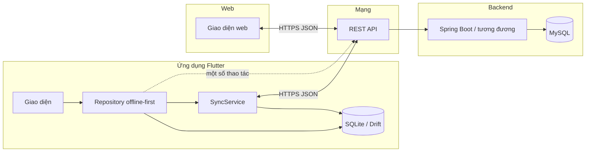

# SQLite và cơ chế đồng bộ dữ liệu trên ứng dụng di động

Tài liệu này mô tả **cách triển khai trong mã nguồn** dự án Expense Manager (Flutter): lớp lưu trữ cục bộ **SQLite**, mối quan hệ với **MySQL** trên server, và **đồng bộ hai chiều** qua REST API — phục vụ trình bày với giảng viên hoặc báo cáo đồ án.

---

## 1. Vai trò của MySQL và SQLite (không xung đột trực tiếp)

| Thành phần | Công nghệ | Vai trò |
|------------|-----------|---------|
| **Máy chủ** | MySQL | Lưu trữ **nguồn sự thật (source of truth)** cho tài khoản người dùng trên hệ thống. |
| **Ứng dụng web** | Trình duyệt + gọi API | Đọc/ghi dữ liệu **thông qua backend**; không giữ bản sao DB độc lập trên trình duyệt (trừ session/cache tạm). |
| **Ứng dụng mobile (Flutter)** | **SQLite** (qua thư viện **Drift**) | Lưu **bản sao cục bộ (local cache)** để dùng **offline** và phản hồi nhanh; khi có mạng thì **đồng bộ** với server qua cùng một **REST API** mà web dùng. |

**Kết luận cho phần thuyết minh:** MySQL và SQLite **không “cạnh tranh”** với nhau. MySQL nằm trên server; SQLite là **bản nhân bản cục bộ** trên thiết bị. Hai bên thống nhất dữ liệu nhờ **cùng một tập API** và **cùng tài khoản đăng nhập** (JWT/token). Nếu web có dữ liệu mà app trống, nguyên nhân thường là: **chưa chạy đồng bộ**, **backend không chạy / sai địa chỉ API**, hoặc **khác user** — không phải vì “SQLite khác MySQL” theo nghĩa hai schema tự mâu thuẫn.

---

## 2. Kiến trúc tổng quan

- **Mobile:** UI chủ yếu đọc/ghi **SQLite** qua repository; `SyncService` chịu trách nhiệm **đẩy thay đổi chờ gửi** và **kéo dữ liệu mới từ server** vào SQLite.
- **Web:** Tương tác trực tiếp với API; dữ liệu hiển thị phản ánh **MySQL** sau khi qua backend.
- **Đồng bộ:** Chỉ xảy ra khi app gọi API (cùng base URL với web, ví dụ `http://<host>:8080/api`).

---

## 3. SQLite trên app: lược đồ và công cụ

### 3.1. Drift (trước đây Moor)

- **Drift** là lớp truy vấn type-safe phía Dart, sinh mã từ định nghĩa bảng; file kết nối mở **SQLite** trên Android/iOS/desktop.
- Các bảng nghiệp vụ chính (rút gọn ý nghĩa):

| Bảng | Mục đích |
|------|----------|
| `categories` | Danh mục thu/chi |
| `wallets` | Ví |
| `transactions` | Giao dịch |
| `budgets` | Ngân sách |
| `recurring_transactions` | Giao dịch định kỳ |
| `sync_outbox` | Hàng đợi thao tác cần gửi lên server (mô hình **Outbox**) |

### 3.2. Hai khóa định danh: `id` cục bộ và `remoteId`

- **`id`:** Khóa tự tăng **chỉ có ý nghĩa trên máy** (primary key trong SQLite).
- **`remoteId`:** Khóa **trùng với `id` bản ghi trên server** sau khi đã đồng bộ; `null` nghĩa là bản ghi tạo offline **chưa** nhận id từ server.

Quan hệ giữa các bảng (ví dụ giao dịch → danh mục) dùng **`categoryLocalId` / `walletLocalId`** (tham chiếu `id` trong SQLite), không dùng trực tiếp `remoteId` của server trong ràng buộc FK — điều này phù hợp mô hình “tạo local trước, map server sau”.

### 3.3. Cờ `pendingSync`

- Cột boolean **`pendingSync`** đánh dấu bản ghi có thay đổi **chưa** xác nhận hoàn tất trên server (tùy luồng insert/update trong repository).
- Sau khi push thành công hoặc sau khi pull khớp với server, cờ được cập nhật phù hợp (ví dụ `false`).

---

## 4. Mô hình Outbox (hàng đợi đồng bộ)

Khi người dùng **tạo / sửa / xóa** dữ liệu lúc **offline** (hoặc trước khi gọi API xong), ứng dụng:

1. Ghi thay đổi vào bảng nghiệp vụ (SQLite).
2. Thêm một dòng vào bảng **`sync_outbox`** với các trường tương tự:
   - **`entity`:** loại thực thể (`category`, `wallet`, `transaction`, …).
   - **`op`:** thao tác (`create`, `delete`, `toggle`, …).
   - **`localId`:** khóa `id` bản ghi trong SQLite.
   - **`payloadJson`:** tùy trường hợp (ví dụ lưu `remoteId` khi xóa bản ghi đã có trên server).

`SyncService.pushOutbox()` xử lý **tuần tự** (FIFO theo `id`): với mỗi dòng outbox, gọi API tương ứng (POST/PUT/DELETE/PATCH). Thành công thì **xóa** dòng khỏi outbox; lỗi mạng thì **dừng** để thử lại sau — tránh mất dữ liệu.

---

## 5. Luồng đồng bộ tổng: `syncAllIfOnline()`

Triển khai trong `SyncService` (khái niệm, khớp mã nguồn):

1. **Điều kiện:** Có mạng (`connectivity_plus`), đã đăng nhập (`LocalStorage`), và không có lần sync khác đang chạy (khóa `_running`).
2. **`pushOutbox()`:** Đẩy toàn bộ hàng đợi lên server; cập nhật `remoteId` khi tạo mới thành công.
3. **`pullAll()`:** Kéo dữ liệu từ server vào SQLite theo thứ tự có phụ thuộc:
   - Danh mục → Ví → Giao dịch, Ngân sách, Định kỳ (giao dịch/ngân sách/định kỳ có thể nhúng/nối category & wallet nên pull sau khi đã có category/wallet).

Sau pull, với **giao dịch / ngân sách / định kỳ**, hệ thống có bước **dọn “mồ côi”**: xóa bản ghi local có `remoteId` **không còn** trong tập id trả về từ server (đồng nghĩa đã bị xóa phía server).

---

## 6. Pull: cập nhật và xóa mồ côi

- **Upsert:** Với mỗi bản ghi JSON từ API, nếu đã có dòng SQLite với cùng `remoteId` thì **cập nhật**; nếu chưa thì **chèn mới**.
- **Đồng bộ danh mục lồng nhau:** Khi pull giao dịch, payload thường kèm object `category` (và có thể `wallet`); code upsert category/wallet trước, rồi gắn `categoryLocalId` (và `walletLocalId`) đúng hàng local.
- **Orphan cleanup:** Các bản ghi đã có `remoteId` nhưng server không còn trả về id đó → coi như đã xóa trên server → **xóa khỏi SQLite** để khớp trạng thái server.

---

## 7. Offline-first trong Repository

Nguyên tắc:

- **Đọc danh sách / màn hình chính:** Ưu tiên đọc từ **SQLite** (nhanh, hoạt động khi mất mạng).
- **Ghi:** Ghi SQLite + enqueue outbox; nếu online thì gọi `syncAllIfOnline()` để đẩy và kéo ngay.
- **Thống kê:** Có thể ưu tiên số liệu local khi offline; khi online có thể đồng bộ rồi tính lại — tùy triển khai `StatisticsRepository`.

Điều này cho phép **một phần chức năng dùng được offline** (xem/sửa dữ liệu đã có, thêm mới vào hàng đợi), và **khớp với web** sau khi đồng bộ thành công.

---

## 8. Các thời điểm gọi đồng bộ trong ứng dụng

| Kích hoạt | Mục đích ngắn gọn |
|-----------|-------------------|
| Sau khi đăng nhập (splash) | Đồng bộ sớm khi vào app. |
| Thay đổi kết nối mạng (`onConnectivityChanged`) | Tự động đồng bộ khi vừa có lại mạng. |
| Mở màn hình Danh mục / Ví / tab Tổng quan / Giao dịch | `syncAllIfOnline()` trước khi load từ DB để danh sách gần với server. |
| Sau thao tác CRUD trong repository | Nhiều repository gọi `syncAllIfOnline()` sau khi ghi local + outbox. |

Nhờ vậy, **“bật mạng”** không chỉ là có Internet mà app còn **chủ động** chạy lại sync (kết hợp listener và mở màn hình).

---

## 9. Giới hạn và câu hỏi thường gặp khi báo cáo

1. **Xung đột chỉnh sửa đồng thời:** Thiết kế hiện tại dựa trên **server là nguồn sự thậy** sau mỗi lần pull; phiên bản “merge phức tạp theo vector clock” **chưa** là trọng tâm — có thể nói thẳng là **ưu tiên đơn giản và nhất quán với backend**.
2. **Phân trang:** Pull giao dịch/ngân sách dùng phân trang (ví dụ `page`, `size`) để không tải hết một lần.
3. **Bảo mật:** Mọi request REST cần token đúng user; SQLite trên máy chỉ chứa dữ liệu **của user đó** sau đăng nhập (và có thể xóa DB khi đăng xuất — tùy triển khai `clearAllData`).

---

## 10. Tóm tắt một câu cho giảng viên

> *Ứng dụng dùng **SQLite** làm bộ nhớ cục bộ để hỗ trợ **offline**; **MySQL** trên server là kho dữ liệu chính. Hai môi trường **không đồng bộ trực tiếp** mà thống nhất qua **REST API**: thay đổi phía app được xếp hàng (**outbox**) rồi đẩy lên; định kỳ hoặc khi mở màn hình, app **kéo** dữ liệu từ server về để cập nhật SQLite, đảm bảo **cùng một tài khoản** thì dữ liệu trên mobile và web **cùng một nguồn** sau khi đồng bộ.*

---

*Tài liệu phản ánh cấu trúc trong mã nguồn Flutter (`lib/data/local/database.dart`, `lib/data/sync/sync_service.dart`, các `*_repository_impl.dart`, `main.dart`, màn splash và màn danh sách). Có thể đính kèm sơ đồ kiến trúc hoặc ảnh chụp luồng đồng bộ khi slide thuyết trình.*
